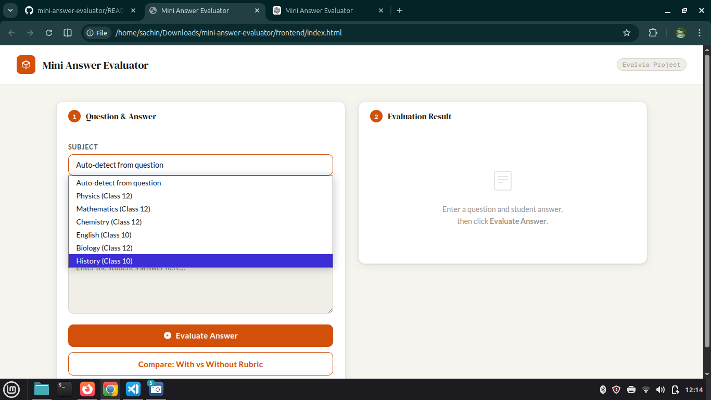
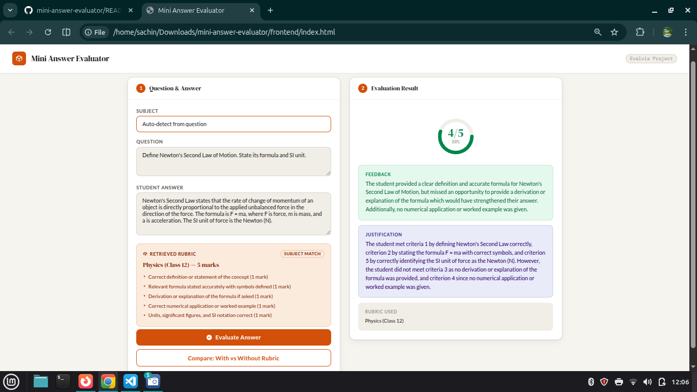
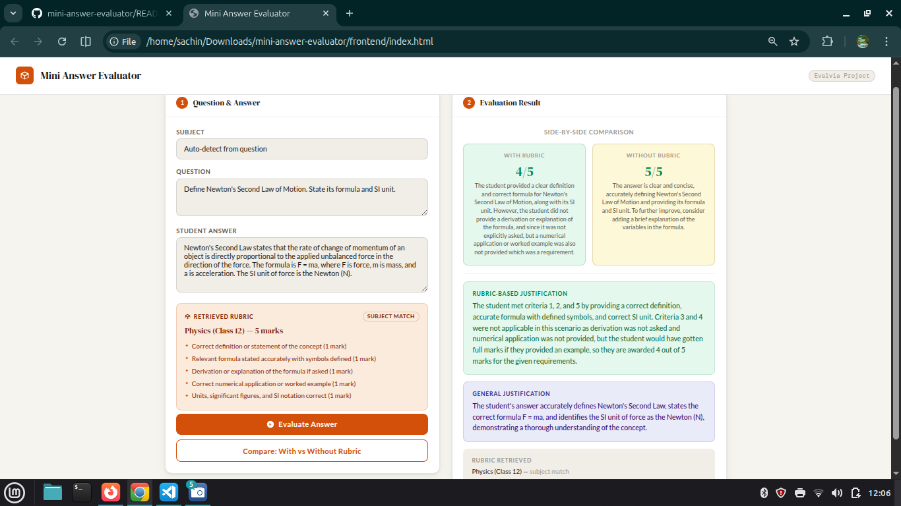

## 🎓 Mini Answer Evaluator

An AI-powered system that evaluates student answers using structured rubrics and LLM intelligence.

---

## ⚙️ How to Run

Open the frontend directly in your browser:

```bash
frontend/index.html
```

> ⚠️ Make sure the backend server is running before evaluation.

---

## 🌐 API Endpoints

| Method | Endpoint               | Description                              |
| ------ | ---------------------- | ---------------------------------------- |
| POST   | `/api/retrieve-rubric` | Returns the most relevant rubric         |
| POST   | `/api/evaluate`        | Evaluates answer (with/without rubric)   |
| POST   | `/api/compare`         | Compares rubric vs non-rubric evaluation |

---

## 🧠 System Design

### 🔍 Rubric Retrieval

* Uses keyword frequency matching
* Counts keyword occurrences per rubric
* Selects the highest scoring rubric
* Falls back to a general rubric if no match

**Supported Subjects:**
Physics • Mathematics • Chemistry • English • Biology • History • Fallback

---

### 🧾 Prompt Strategy

#### ✅ With Rubric

* Explicit criteria passed to LLM
* Marks assigned per criterion
* Detailed reasoning included

#### ❌ Without Rubric

* General evaluation (accuracy, clarity, completeness)
* Scored out of 5

**System Prompt:**

> "You are an expert academic evaluator. Evaluate answers fairly and return ONLY valid JSON."

---

### 📦 Structured Output

* Uses Groq structured JSON response
* `response_format = { "type": "json_object" }`
* Eliminates parsing issues
* Ensures backend reliability

---

## 📋 Rubric Format

```json
{
  "name": "Physics (Class 12)",
  "keywords": ["force", "motion", "newton", "energy"],
  "max_marks": 5,
  "criteria": [
    "Correct definition or concept (1 mark)",
    "Accurate formula with symbols (1 mark)"
  ]
}
```

👉 To add a new subject, update `RUBRICS` in `rubrics.py`

---

## 🔮 Future Improvements

* Regex-based keyword matching (reduce false positives)
* Embedding-based semantic retrieval
* Per-criterion scoring for better granularity
* Rubric editor UI for teachers
* Answer history using SQLite
* Batch evaluation via CSV upload

---

## 💻 Tech Stack

* **Backend:** Python 3.12, Flask, python-dotenv
* **LLM:** Groq API (Llama 3.3 70B)
* **Frontend:** HTML, CSS, JavaScript
* **Retrieval:** Keyword-based matching

---

## 🔐 Environment Variable

```
GROQ_API_KEY = your_api_key_here
```

---

## ✨ Why This Project Stands Out

* Combines LLM intelligence with structured rubrics
* Produces explainable and consistent evaluations
* Clean modular architecture (retrieval + evaluation)
* Designed for real-world scalability

---

## 🖼️ Demo Preview

### 🔹 Main Interface

> Input question and student answer for evaluation
> 

---

### 🔹 Evaluation Output

> Displays marks, feedback, and justification
> 

---

### 🔹 Compare Mode

> Shows difference between rubric-based and generic evaluation
> 

---

## 📌 Final Note

This project demonstrates how combining **simple retrieval techniques with powerful LLMs** can create **reliable, explainable, and scalable AI systems** for education.

---
